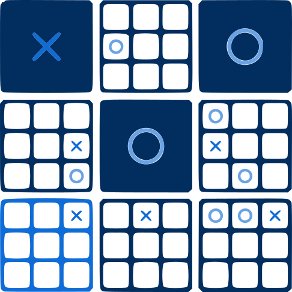

# UltimateXO 🎯

[](https://github.com/open-syntax/ultimatexo/actions/workflows/ci.yml)
[](https://github.com/open-syntax/ultimatexo/actions/workflows/build.yml)
[](LICENSE)
[](CONTRIBUTING.md)

[](https://ko-fi.com/opensyntax)

A fast, modern way to play **Ultimate Tic-Tac-Toe** online — free and open source.\
Rust powers the backend ⚡, and Vite + HeroUI power the frontend 🎨

**Play now:** [https://UltimateXO.com](https://UltimateXO.com)



## What Is Ultimate Tic-Tac-Toe?

It’s Tic-Tac-Toe played on a **3×3 grid of 3×3 boards** (81 squares).
Each move sends your opponent to a specific sub-board, creating a mix of local tactics and big-picture strategy.

## Features ✨

* Clean, responsive web UI
* Fast Rust engine
* Real-time moves
* Works great on desktop & mobile
* Automated CI/CD
* Fully open source

## Tech Stack 🛠️

* **Frontend:** Vite, React, TypeScript, HeroUI, pnpm
* **Backend:** Rust, axum, Tokio
* **Infra:** Docker, Caddy, Cloudflare, GitHub Actions

## Getting Started 🚀

**Requirements:** Node 20+, pnpm 8+, Rust 1.75+, Docker (optional)

```bash
git clone https://github.com/open-syntax/ultimatexo.git
cd ultimatexo
```

Install:

```bash
just setup
# or:
cd client && pnpm install
cd ../server && cargo build
```

Run:

```bash
just dev
# Client: http://localhost:5173
# Server: http://localhost:6767
```

### Using Docker

```bash
just docker-build
just docker-up
```

## How to Play 🎮

1. The board is a 3×3 grid of smaller boards
2. X starts anywhere
3. Your move decides where the opponent must play next
4. Win small boards with three-in-a-row
5. Win the game by taking three small boards in a row
6. If a sub-board is finished, you can play anywhere

## Contributing 🤝

Contributions welcome!
Focus areas: testing, UI, WebSocket reliability, documentation, accessibility.\
See [CONTRIBUTING.md](CONTRIBUTING.md)

## Security 🔒

See [SECURITY.md](SECURITY.md)

## License 📜

[AGPLv3](LICENSE.md)

## Support 💬

[Issues](https://github.com/open-syntax/ultimatexo/issues) • [Discussions](https://github.com/open-syntax/ultimatexo/discussions) • [Discord](https://discord.gg/5K3d574234) • [UltimateXO.com](https://UltimateXO.com)

## Support us ☕

If you find this useful, Please consider supporting us on [Ko-Fi](https://ko-fi.com/opensyntax), or just star the repo :)

---

Ready to play? 🎯
