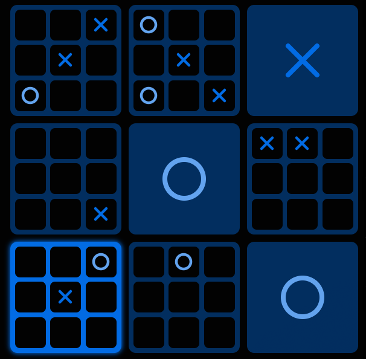

# UltimateXO 🎯

[](https://github.com/open-syntax/ultimatexo/actions/workflows/ci.yml)
[](https://github.com/open-syntax/ultimatexo/actions/workflows/build.yml)
[](LICENSE)
[](CONTRIBUTING.md)

The fastest, sleekest, and most fun way to play **Ultimate Tic-Tac-Toe**
online — free and open source. Built with a Rust backend ⚡ and a modern
Vite + HeroUI frontend 🎨.

**🎮 Play instantly at [UltimateXO.com](https://UltimateXO.com)**



## What is Ultimate Tic-Tac-Toe?

Ultimate Tic-Tac-Toe is a strategic variant of the classic game that adds
layers of complexity and excitement. Instead of a single 3×3 grid, you play
on a 3×3 grid of 3×3 grids (81 squares total). The twist? Your opponent's
move determines which sub-grid you must play in next, creating a dynamic
game where local tactics meet global strategy.

## Features ✨

- **Modern Web Interface**: Built with Vite and styled with HeroUI for a
  smooth, responsive experience
- **Fast Rust Backend**: Lightning-fast game logic and state management
  powered by Rust
- **Real-time Gameplay**: Instant move validation and game state updates
- **Strategic Depth**: Experience the complexity of Ultimate Tic-Tac-Toe's
  nested gameplay
- **Mobile Friendly**: Optimized for both desktop and mobile devices
- **Production Ready**: Comprehensive CI/CD with automated testing,
  security scanning, and zero-downtime deployments
- **Open Source**: Completely free to use, modify, and contribute to

## Tech Stack 🛠️

### Frontend

- **Vite** - Fast build tool and development server
- **React** + **TypeScript** - Type-safe modern UI framework
- **React Router** - Powerful, declarative routing library
- **HeroUI** - Modern component library for beautiful interfaces
- **pnpm** - Fast, efficient package manager

### Backend

- **Rust** - High-performance, memory-safe game engine
- **axum** - Fast web framework for Rust
- **Tokio** - Async runtime

### Infrastructure

- **Docker** - Containerization for consistent deployments
- **Caddy** - Modern web server with automatic HTTPS
- **Cloudflare** - DNS and DDoS protection
- **GitHub Actions** - Automated CI/CD pipeline

## Getting Started 🚀

### Prerequisites

- Node.js 20+
- pnpm 8+
- Rust 1.75+
- Just command runner (optional but recommended)
- pre-commit (optional but recommended)
- Docker & Docker Compose (for production deployment)

### Installation

1. **Clone the repository**

   ```bash
   git clone https://github.com/open-syntax/ultimatexo.git
   cd ultimatexo
   ```

2. **Install dependencies**

   ```bash
   just setup
   # or manually:
   cd client && pnpm install
   cd ../server && cargo build
   ```

3. **Start the development server**

   ```bash
   just dev
   # or start individually:
   # cd client && pnpm run dev    # Client on :5173
   # cd server && cargo run        # Server on :6767
   ```

4. **Open your browser**
   Navigate to `http://localhost:5173` to start playing!

### Using Docker

```bash
# Build and run with Docker Compose
just docker-build
just docker-up

# View logs
just docker-logs

# Stop services
just docker-down
```

Visit: <http://localhost>

## How to Play 🎮

1. **The Big Picture**: You're playing on a 3×3 grid of smaller tic-tac-toe
   boards
2. **First Move**: Player X can choose any square on any sub-grid
3. **The Rule**: Your move determines which sub-grid your opponent must play
   in next
4. **Winning Sub-grids**: Win a sub-grid by getting three in a row (just like
   regular tic-tac-toe)
5. **Winning the Game**: Get three sub-grids in a row to win the ultimate
   game!
6. **Special Cases**: If you're sent to a completed sub-grid, you can play
   anywhere

## Development 🔧

### Project Structure

```text
ultimatexo/
├── .github/              # CI/CD workflows and configurations
│   ├── workflows/        # GitHub Actions workflows
│   └── ISSUE_TEMPLATE/   # Issue and PR templates
├── client/               # Vite + HeroUI frontend
│   ├── src/
│   ├── public/
│   ├── Dockerfile
│   └── package.json
├── server/               # Rust game engine
│   ├── src/
│   ├── Dockerfile
│   ├── Cargo.toml
│   └── Cargo.lock
├── scripts/              # Utility scripts
│   ├── deploy.sh
│   └── health-check.sh
├── docker-compose.yml    # Docker orchestration
├── Caddyfile            # Reverse proxy config
├── justfile             # Command runner recipes
└── README.md
```

### Available Commands

```bash
just help
```

### Pre-commit Hooks

We use pre-commit hooks to ensure code quality:

```bash
# Install hooks
pip install pre-commit
pre-commit install

# Run manually
pre-commit run --all-files
```

## Contributing 🤝

We welcome contributions!
Please see our [Contributing Guide](CONTRIBUTING.md) for details.

### Areas Needing Improvement

- **Testing**: Write comprehensive tests for both client and server
- **UI/UX**: Improve the client interface and user experience
- **WebSocket**: Enhance server WebSocket handling and reliability
- **Documentation**: Expand guides and add more examples
- **Accessibility**: Improve keyboard navigation and screen reader support

### Quick Contribution Guide

1. **Fork the repository**
2. **Create a feature branch** (`git checkout -b feature/amazing-feature`)
3. **Make your changes**
4. **Run tests and linting** (`just ci-local`)
5. **Commit using [Conventional Commits](https://www.conventionalcommits.org/)**
6. **Push to your fork** (`git push origin feature/amazing-feature`)
7. **Open a Pull Request**

## Security 🔒

See [SECURITY.md](SECURITY.md) for reporting vulnerabilities.

## License 📜

This project is licensed under the GNU Affero General Public License v3.0
(AGPLv3). See the [LICENSE](./LICENSE) file for details.

## Acknowledgments 🙏

- Ultimate Tic-Tac-Toe game concept and rules
- The Rust community for excellent tooling and libraries
- Vite team for the blazing-fast build tool
- HeroUI for the beautiful component library
- All contributors who help make this project better

## Support 💬

- **Issues**: Found a bug?
  [Report it here](https://github.com/open-syntax/ultimatexo/issues)
- **Discussions**: Have ideas or questions?
  [Join the discussion](https://github.com/open-syntax/ultimatexo/discussions)
- **Website**: [UltimateXO.com](https://UltimateXO.com)
- **Discord**: [Open Syntax](https://discord.gg/5K3d574234)

### Support us ☕

If you find this package useful, you can support us on Ko-Fi (or just star the repo):

[](https://ko-fi.com/ultimatexo)

---

**Ready to challenge your strategic thinking? Play UltimateXO today!** 🎯
